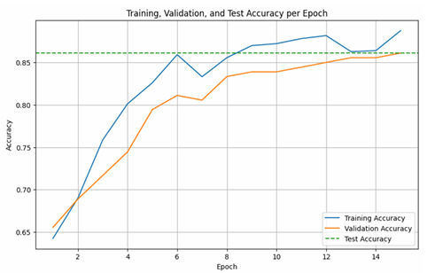
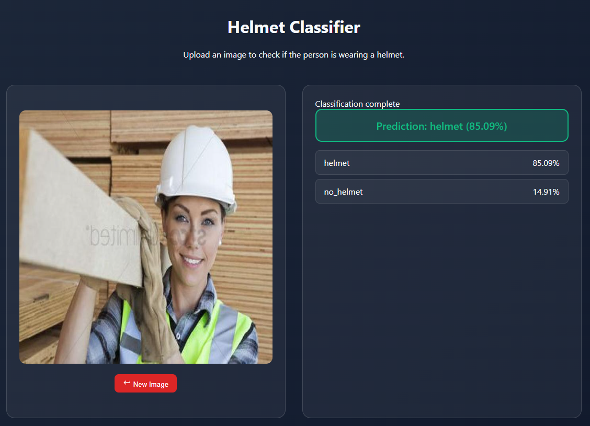

# INF3001_Project  
## Beyond Helmets: Attention-Augmented, Domain-Robust Multi-Label PPE Recognition

[](https://www.python.org/)  [](https://fastapi.tiangolo.com/)  [](https://pytorch.org/)  []() 

---

## Project Overview

This project investigates deep learning–based automation for detecting Personal Protective Equipment (PPE) usage in hazardous work environments.  
Manual inspection remains time-consuming, inconsistent, and challenging to scale in dynamic conditions.  

Through the integration of computer vision and attention-augmented convolutional networks, this project seeks to develop a robust, scalable, and interpretable PPE recognition framework capable of generalizing across environmental variations.

---

## Development Phases

### Phase 1 (Week 6): Binary Classification Prototype

The initial implementation focuses on binary image classification to detect whether a subject is wearing a safety helmet.  

Key deliverables:
- Curated and cleaned a binary dataset (helmet / no helmet)
- Implemented transfer learning with **ResNet-18** as the base architecture
- Incorporated **data augmentation** (rotation, color jitter, random erasing) for domain robustness
- Trained using **SGD with momentum** and **dropout regularization**
- Evaluated model performance using accuracy, F1-score, and Grad-CAM visualizations

#### Experimental Findings (Phase 1)

A sequence of eleven controlled experiments was conducted to optimize the ResNet-18 classifier for helmet/no-helmet detection.  
Each iteration focused on refining generalization performance through systematic adjustment of learning parameters:contentReference[oaicite:0]{index=0}.

| Run | Configuration Highlights | Test Loss | Test Accuracy |
|:--:|:--|:--:|:--:|
| 1 – 2 | Baseline (Adam, LR = 1e-4, WD = 1e-3) | ≈ 0.42 – 0.43 | – |
| 3 | Adam, tuned hyperparameters | 0.4143 | 0.8388 |
| 5 | Adam + minor adjustments | 0.3752 | 0.8678 |
| 6 | Switched to **SGD + Momentum = 0.9** | 0.5695 | 0.686 |
| 7 | Increased momentum → 0.95 | 0.5231 | 0.7521 |
| 8 – 9 | Added **Dropout (0.5)** | 0.4954 | 0.7727 |
| 10 | Cleaned dataset + SGD + Dropout (0.5) | **0.3118** | **0.9222** |
| 11 | Disabled dropout | 0.3842 | 0.8611 |

**Observations**

- The transition from **Adam to SGD + momentum (0.9 – 0.95)** stabilized training and mitigated oscillations.  
- **Dropout (p = 0.5)** proved decisive, improving generalization from 0.7727 to 0.9222 accuracy.  
- Removing dropout produced a marginal decrease (0.8611 acc), confirming its regularization benefit.  
- Dataset cleaning and balanced augmentation substantially reduced overfitting.

---

#### Visual Results

| Training, Validation, and Test Loss | Training, Validation, and Test Accuracy |
|:--:|:--:|
|  |  |

*Figure 1. Loss (left) and accuracy (right) curves across 15 epochs, demonstrating stable convergence and consistent generalization.*

| Grad-CAM Visualization |
|:--:|
|  |

*Figure 2. Grad-CAM overlay highlighting the discriminative helmet region, confirming spatial interpretability of the trained model.*

---

These results establish a strong binary-classification baseline with ResNet-18, achieving 92 % test accuracy.  
They form the empirical foundation for **Phase 2**, which will extend the pipeline to multi-label classification and object detection.


---

### Phase 2 (Week 12): Multi-Label and Object Detection Extension

The second phase expands the project scope to multi-label PPE classification and localized object detection.  

Planned extensions:
- Modify the classification head to support multiple PPE categories (e.g., helmet, vest, mask, gloves)
- Integrate attention modules such as **CBAM** for enhanced feature discrimination
- Extend to **object detection** for spatial localization of PPE elements
- Improve the web application interface to:
  - Support comparison between multiple trained models
  - Display per-class detection confidence and bounding boxes in real time
  - Provide a modular architecture for future expansion

Phase 2 aims to transition the system from a binary classifier to a multi-class, explainable detection framework suitable for real-world deployment.

---

## Objectives

- Develop an multi-label image classification and detection system for PPE compliance monitoring  
- Leverage transfer learning for efficient convergence and enhanced generalization  
- Integrate attention mechanisms to improve robustness under occlusion and clutter  
- Deploy an interactive web interface for real-time analysis and comparison across models  
- Establish a foundation for scalable, multi-label PPE recognition and visualization  

---

## Methodology

### 1. Dataset Preparation
- Stratified split into training, validation, and test sets  
- Applied augmentation to simulate diverse lighting and positional conditions  
- Employed normalization consistent with ImageNet preprocessing  

### 2. Model Architecture
- Baseline: **ResNet-18** pretrained on ImageNet  
- Final layer replaced with task-specific classifier head  
- Planned integration of **CBAM** for channel and spatial attention refinement  

### 3. Training Strategy
- Optimizer: SGD with momentum (0.9–0.95)  
- Learning rate: 1e-4  
- Regularization via dropout (p=0.5) and weight decay (1e-3)  
- Mixed-precision (AMP) training on GPU for computational efficiency  

### 4. Evaluation
- Metrics: Accuracy, F1-score, Precision, Recall  
- Visualization: Grad-CAM for interpretability  
- Comparative analysis across optimizers and regularization settings  

---

## Results Summary (Phase 1)

| Metric | Best Model |
|--------|-------------|
| Test Accuracy | 0.9222 |
| Test Loss | 0.3118 |
| Validation Accuracy | 0.8681 |
| Training Loss | 0.2003 |

Regularization through dropout significantly improved generalization. Momentum optimization stabilized convergence across epochs, while data quality and augmentation consistency were key determinants of performance.

---

## Future Work (Phase 2)

Iteration 1: Initial Large-Scale Training
Dataset: Based on a large 42k photo Roboflow dataset, augmented (rotation, grayscale) and multiplied by 3x for a total of over 100k images.

Data Imbalance: Evident from 1st_dataset.png where Hardhat instances (approx. 87k) significantly overwhelm other classes.

Training Time: Over 7 hours and 52 minutes.

Results (1st_result.png): Moderate performance, likely due to high class imbalance.

Loss: All training and validation losses show a good, clear downward trend.

Key Metrics: Validation mAP50 reaches approximately 0.78, and mAP50-95 reaches around 0.53.

----------------------------------------------------------------------------------------------
Iteration 2: Focus with Reduced Dataset
Dataset Adjustment: Drastically reduced to 2,000 hand-picked images with the same 3x augmentation for a total of over 6,000 images.

Class Focus: Concentrated on 6 main classes (e.g., Gloves, Helmet, Vest, etc.) for a more focused task.

Dataset Statistics (2nd_dataset.png): Shows some remaining imbalance, with Helmet (~1,641) much lower than No-Helmet (~2,222).

Results (2nd_result.png): Performance slightly better due to reduced class complexity.

Key Metrics: mAP50 is high, reaching around 0.71. mAP50-95 improves to about 0.41.

----------------------------------------------------------------------------------------------
Iteration 3: Bounding Box Refinement

Dataset Refinement: Focused on identifying and adding more missing bounding boxes (e.g., adding boxes for personnel wearing helmets who were previously un-annotated).

Impact on Instances (3rd_dataset.png): The number of Helmet instances jumped significantly by 
~1,428 (from 1,641 to 3,069).

Results (3rd_result.png): Model confidence and prediction capability increased.

Validation Loss: The curves for validation loss show more instability/spikiness, suggesting the richer annotations are challenging the model more.

Key Metrics: mAP50-95 shows a considerable increase, stabilizing around 0.35-0.37.

----------------------------------------------------------------------------------------------
Iteration 4: Instance Balancing and Validation Cleaning

Dataset Focus: Primary focus on balancing class instances and a full cleaning of the validation set.

Dataset Statistics (4th_dataset.png): Shows a much more balanced distribution (e.g., Gloves  ~2,181 vs. Helmet ~2,167).

Results (4th_result.png): Further improved prediction capability, especially when tested live.

Key Metrics: The mAP50-95 metric shows continued improvement in stability and real-world performance, stabilizing near 0.32-0.34.
---

## Dataset References

1. [Ultralytics Construction PPE Dataset](https://docs.ultralytics.com/datasets/detect/construction-ppe/#business-value)  
2. [Snehil Sanyal – Construction Site Safety PPE Detection (GitHub)](https://github.com/snehilsanyal/Construction-Site-Safety-PPE-Detection)  
3. [Safety Helmet Wearing Dataset (Roboflow)](https://universe.roboflow.com/zayed-uddin-chowdhury-ghymx/safety-helmet-wearing-dataset/browse)

---

## Classifier Web Application

The FastAPI-based web application serves as an inference layer for the trained model.  
It enables real-time classification from image uploads and visualizes predictions using attention heatmaps and probability scores.

### Features
- Image upload or drag-and-drop inference  
- Real-time classification powered by PyTorch  
- Responsive user interface implemented in HTML, CSS, and JavaScript  
- Planned multi-model comparison dashboard (Phase 2)  

---
### Web Application Interface

Below is the Phase 1 binary classification interface demonstrating real-time inference through the FastAPI backend.

<p align="center">
  
</p>

*Figure 3. Binary Helmet Classifier web interface showing predicted class probabilities.*

## Setup and Installation

### Clone the Repository
```bash
git clone https://github.com/ZulfaqarHafez/INF3001_Project.git
cd INF3001_Project
```
### Backend (FastAPI + PyTorch)
```bash
python -m venv venv
source venv/bin/activate   # macOS/Linux
venv\Scripts\activate      # Windows
pip install -r requirements.txt
cd backend
uvicorn main:app --reload --port 8000
```
Backend runs at: http://127.0.0.1:8000
API documentation: http://127.0.0.1:8000/docs
### Frontend
```bash
cd frontend
python -m http.server 5500
```
Open in browser: http://127.0.0.1:5500/frontend/index.html


## SIT – AAI3001 (Deep Learning and Computer Vision, Trimester 1, 2025)
## Team

| [](https://www.linkedin.com/in/zulfaqar-hafez/) <br> [**Muhammad Zulfaqar Bin Abdul Hafez**](https://www.linkedin.com/in/zulfaqar-hafez/) | [](https://www.linkedin.com/in/danielchuasy/) <br> [**Chua Shan Yang Daniel**](https://www.linkedin.com/in/danielchuasy/) | [](https://www.linkedin.com/in/shawn-lim-1b8186a2/) <br> [**Lim Si Wei Shawn**](https://www.linkedin.com/in/shawn-lim-1b8186a2/) | [](https://www.linkedin.com/in/teo-royston-32653318b/) <br> [**Teo Royston**](https://www.linkedin.com/in/teo-royston-32653318b/) | [](https://www.linkedin.com/in/tan-chun-yuan/) <br> [**Tan Chun Yuan (Max)**](https://www.linkedin.com/in/tan-chun-yuan/) |
|:--:|:--:|:--:|:--:|:--:|

