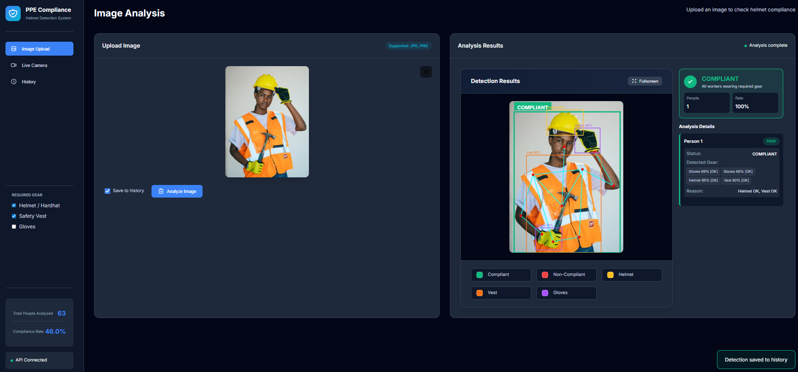
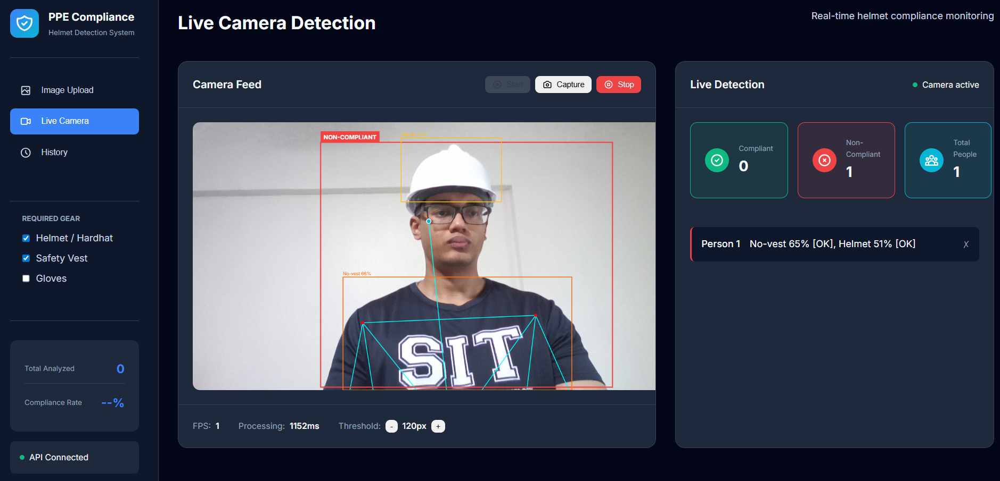
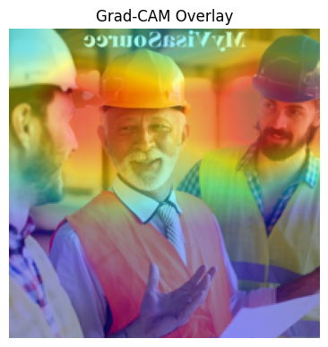
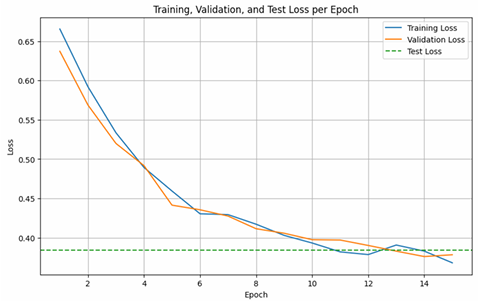
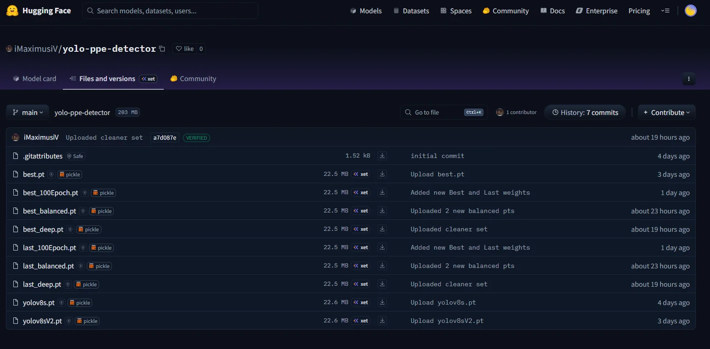

# AAI3001_Project  
## Beyond Helmets: Real-Time Multi-Label PPE Detection with Pose-Aware Validation

[](https://www.python.org/)  [](https://fastapi.tiangolo.com/)  [](https://docs.ultralytics.com/)  [](https://google.github.io/mediapipe/)  [](https://supabase.com/)  []() 

> **Real-time PPE compliance monitoring with pose-aware validation** | Deployed full-stack web application with dynamic requirements and cloud-based history tracking

---

## 📋 Table of Contents
- [Project Overview](#project-overview)
- [Key Features](#key-features)
- [System Demo](#system-demo)
- [Quick Start](#quick-start)
- [Architecture Overview](#architecture-overview)
- [Performance Metrics](#performance-metrics)
- [Documentation](#documentation)

---

## Project Overview

This project delivers a **production-ready** deep learning system for automated Personal Protective Equipment (PPE) compliance monitoring in hazardous work environments. Manual inspection remains time-consuming, inconsistent, and challenging to scale across dynamic industrial conditions.

### What Makes This Different?

🎯 **Pose-Aware Validation** - Doesn't just detect PPE; validates it's worn at anatomically correct locations using MediaPipe pose estimation

🔄 **Dynamic Requirements** - Adapt compliance rules on-the-fly via sidebar toggles without retraining the model

📊 **Complete Training Journey** - Documented iterative development from 100k imbalanced images to 6k perfectly balanced dataset

🌐 **Production Deployment** - Full-stack web application with FastAPI backend, vanilla JS frontend, and Supabase cloud storage

---

## Key Features

### ✨ Core Capabilities

| Feature | Description |
|---------|-------------|
| **Multi-Label Detection** | Simultaneously detects helmets, vests, gloves, masks, machinery, and vehicles |
| **Pose Estimation** | 33 body landmarks tracked for anatomical validation |
| **Dual Validation** | Combines bounding box distance + MediaPipe landmarks for accuracy |
| **Real-Time Processing** | Live camera feed support with 1-2 FPS on CPU |
| **Dynamic Requirements** | Toggle PPE requirements via UI without retraining |
| **Cloud History** | Persistent detection logging with Supabase integration |
| **Snapshot Export** | Save annotated frames with timestamps |

### 🎨 Web Application Views

The system features three main interfaces:

1. **Image Upload** - Drag-and-drop analysis with detailed breakdown
2. **Live Camera** - Real-time detection with performance metrics
3. **Detection History** - Browse, filter, and analyze past detections

---

## System Demo

### Image Upload Analysis

<p align="center">
  
</p>

*Worker with complete PPE (helmet, vest, gloves) detected and validated as COMPLIANT. Skeleton overlay shows pose estimation landmarks used for anatomical validation.*

<p align="center">
  
</p>

*Worker missing required safety vest flagged as NON-COMPLIANT with detailed violation breakdown.*

---

### Live Camera Detection - Dynamic Requirements Demo

<p align="center">
  
</p>

*Same person marked NON-COMPLIANT when both helmet and vest are required (Helmet ✓, Vest ✓ checked in sidebar)*

<p align="center">
  
</p>

*Immediately marked COMPLIANT when vest requirement is removed (Helmet ✓ only). **This demonstrates the dynamic requirements system** - same detection, different compliance outcome based on configurable rules!*

---

### Detection History Dashboard

<p align="center">
  
</p>

*Dashboard showing 46 total scans with 44.6% compliance rate. Filter by All/Compliant/Violations. Each card shows Pass/Fail status with timestamp.*

<p align="center">
  
</p>

*Detailed modal view with skeleton overlay, per-person analysis, and violation breakdown.*

---

## Quick Start

### Prerequisites
- Python 3.11+
- Node.js (for frontend development)
- Webcam (for live detection)

### Installation

```bash
# 1. Clone repository
git clone https://github.com/ZulfaqarHafez/AAI3001_Deep_Learning.git
cd AAI3001_Deep_Learning

# 2. Install backend dependencies
cd backend
pip install -r requirements.txt

# 3. Set up environment variables
cp .env.example .env
# Edit .env with your Supabase credentials

# 4. Run backend server
python backend_api.py
# Server runs on http://localhost:8080

# 5. Open frontend (in new terminal)
cd ../frontend
# Open index.html in browser or use Live Server
```

### Quick Test

```bash
# Test with sample image
curl -X POST http://localhost:8080/process-image \
  -F "file=@test_image.jpg" \
  -F "save_to_history=false"
```

**For detailed setup instructions:** See [docs/INSTALLATION.md](docs/INSTALLATION.md)

---

## Architecture Overview

### System Design

```
┌─────────────────────────────────────────────────────────────┐
│                      Frontend (Vanilla JS)                   │
│  ┌──────────────┐  ┌──────────────┐  ┌──────────────┐       │
│  │ Image Upload │  │ Live Camera  │  │   History    │       │
│  └──────────────┘  └──────────────┘  └──────────────┘       │
└─────────────────────────────┬───────────────────────────────┘
                              │ REST API
┌─────────────────────────────▼───────────────────────────────┐
│                    FastAPI Backend (Python)                  │
│  ┌──────────────────────────────────────────────────────┐   │
│  │           Detection Pipeline Manager                  │   │
│  │  ┌──────────────┐  ┌──────────────┐  ┌────────────┐ │   │
│  │  │   YOLOv8n    │→ │  YOLOv8 PPE  │→ │ MediaPipe  │ │   │
│  │  │ (Person Det) │  │ (Gear Det)   │  │ (Pose Est) │ │   │
│  │  └──────────────┘  └──────────────┘  └────────────┘ │   │
│  │                          ↓                            │   │
│  │              Dual Validation Engine                   │   │
│  │  (Euclidean Distance + Landmark Matching)            │   │
│  └──────────────────────────────────────────────────────┘   │
│                              │                               │
│                              ▼                               │
│                    Compliance Evaluator                      │
│              (Dynamic Requirements Checker)                  │
└─────────────────────────────┬───────────────────────────────┘
                              │
┌─────────────────────────────▼───────────────────────────────┐
│                    Supabase Cloud Storage                    │
│           (Detection History + Image Storage)                │
└─────────────────────────────────────────────────────────────┘
```

### Technology Stack

**Backend:**
- FastAPI 0.110 - REST API framework
- YOLOv8 (Ultralytics) - Object detection
- MediaPipe - Pose estimation
- Supabase - Cloud database & storage
- OpenCV - Image processing

**Frontend:**
- Vanilla JavaScript (ES6+)
- Modern CSS with flexbox/grid
- Dark theme UI

**Model:**
- Custom YOLOv8 trained on construction PPE dataset
- Hosted on Hugging Face: `iMaximusiV/yolo-ppe-detector`
- Production model: `best_100Epoch.pt` (22.5 MB)

**For detailed architecture:** See [docs/TECHNICAL_IMPLEMENTATION.md](docs/TECHNICAL_IMPLEMENTATION.md)

---

## Performance Metrics

### Model Performance (Final Production Model)

| Metric | Value | Description |
|--------|-------|-------------|
| **Precision** | 0.75 | High confidence predictions (fewer false positives) |
| **Recall** | 0.52-0.63 | Conservative detection (prioritizes accuracy) |
| **mAP50** | 0.62-0.64 | Strong detection at 50% IoU threshold |
| **mAP50-95** | 0.35-0.36 | Robust across IoU thresholds |
| **Inference Speed** | 1-2 FPS | CPU-based processing (real-time capable) |

### Training Evolution

| Iteration | Dataset Size | Key Focus | mAP50-95 | Outcome |
|-----------|--------------|-----------|----------|---------|
| Iter 1 | 100,000+ | Large-scale | 0.53 | ⚠️ Class imbalance issues |
| Iter 2 | 6,000 | Curated quality | 0.41 | ✅ Faster iteration |
| Iter 3 | 6,000 | Re-annotation | 0.35-0.37 | ✅ Better recall |
| Iter 4 | ~6,000 | Class balance | 0.32-0.34 | ✅ Real-world performance |
| **Iter 5** | **~6,000** | **Production** | **0.35-0.36** | ✅ **Deployed model** |

**Key Insight:** Quality over quantity - 6,000 curated and balanced images outperformed 100,000 imbalanced images!

**For complete training analysis:** See [docs/MODEL_TRAINING.md](docs/MODEL_TRAINING.md)

---

## Documentation

### 🎓 Phase 1 Documentation

Phase 1 focused on binary classification (helmet/no helmet) using ResNet-18:

<p align="center">
  
</p>

*Grad-CAM visualization showing model attention on head region (Phase 1 explainability)*

<p align="center">
  
</p>

*Training/validation loss curves showing convergence. Best model: 92.22% test accuracy with dropout regularization.*

**Phase 1 Results:**
- 11 experimental iterations
- Best accuracy: 92.22% (Run 10: SGD + Dropout 0.5 + cleaned dataset)
- Key finding: Dropout regularization critical for generalization

---

## Development Journey

### From Classification to Production Detection

**Week 6 (Phase 1):**
- Binary classification (helmet yes/no)
- ResNet-18 with transfer learning
- 92.22% accuracy achieved
- Grad-CAM for explainability

**Week 12 (Phase 2):**
- Multi-label object detection
- YOLOv8 + MediaPipe integration
- Pose-aware validation
- Full-stack web application
- Dynamic requirements system
- Cloud-based history tracking

### Model Training Highlights

<p align="center">
  
  
</p>

*Left: Iteration 1 with severe class imbalance (86k hardhats). Right: Iteration 4 with perfect balance (2,181 ≈ 2,167).*

<p align="center">
  
</p>

*Final production model training curves showing excellent convergence and stability.*

**Training Lessons Learned:**
1. ✅ Quality > Quantity: 6k curated beats 100k imbalanced
2. ✅ Class balancing significantly improves real-world performance
3. ✅ Missing annotations hurt recall more than small datasets
4. ✅ High precision preferred for safety applications

**Complete training details:** [docs/MODEL_TRAINING.md](docs/MODEL_TRAINING.md)

---

## Custom Model Repository

<p align="center">
  
</p>

*Custom PPE detection model hosted on Hugging Face with multiple checkpoints and variants.*

**Model Access:**
- Repository: [`iMaximusiV/yolo-ppe-detector`](https://huggingface.co/iMaximusiV/yolo-ppe-detector)
- Production Model: `best_100Epoch.pt` (22.5 MB)
- Training: 1,200+ images, ~8,500 annotations
- Classes: 6 (Hardhat, Vest, Mask, Cone, Machinery, Vehicle)

---

## API Overview

### Core Endpoints

```python
POST /process-image
# Upload and analyze image for PPE compliance

GET /get-detection-history
# Retrieve all saved detections

DELETE /delete-detection/{id}
# Remove specific detection record

DELETE /clear-history
# Clear all detection history

POST /process-video
# Real-time video frame analysis
```

**Full API documentation:** [docs/API_DOCUMENTATION.md](docs/API_DOCUMENTATION.md)
---

## Team Members

| [](https://www.linkedin.com/in/zulfaqar-hafez/) <br> [**Zulfaqar Hafez**](https://www.linkedin.com/in/zulfaqar-hafez/) | [](https://www.linkedin.com/in/danielchuasy/) <br> [**Daniel Chua**](https://www.linkedin.com/in/danielchuasy/) | [](https://www.linkedin.com/in/shawn-lim-1b8186a2/) <br> [**Shawn Lim**](https://www.linkedin.com/in/shawn-lim-1b8186a2/) | [](https://www.linkedin.com/in/teo-royston-32653318b/) <br> [**Royston Teo**](https://www.linkedin.com/in/teo-royston-32653318b/) | [](https://www.linkedin.com/in/tan-chun-yuan/) <br> [**Tan Chun Yuan (Max)**](https://www.linkedin.com/in/tan-chun-yuan/) |
|:--:|:--:|:--:|:--:|:--:|

**Contribution:**
- Zulfaqar Hafez - System Architecture, Full-Stack Development
- Max Tan - Model Training
- Shawn Lim - Model Training
- Daniel Chua - Model Training
- Royston Teo - Full-Stack

**Acknowledgments:**
- Dataset sources: Ultralytics, Snehil Sanyal, Roboflow
- Frameworks: Ultralytics YOLOv8, Google MediaPipe
- Infrastructure: Hugging Face, Supabase

---

## License

This project is developed for academic purposes as part of AAI3001 Deep Learning course at Singapore Institute of Technology.

---

## Contact & Links

**Repository:** [github.com/ZulfaqarHafez/AAI3001_Deep_Learning](https://github.com/ZulfaqarHafez/AAI3001_Deep_Learning)  
**Model:** [huggingface.co/iMaximusiV/yolo-ppe-detector](https://huggingface.co/iMaximusiV/yolo-ppe-detector)  
**Institution:** Singapore Institute of Technology  
**Course:** AAI3001 - Deep Learning  
**Year:** 2024-2025

---

<p align="center">
  <strong>Built with passion for workplace safety</strong>
</p>

<p align="center">
  <sub>Last Updated: November 29, 2025 | Version 2.0</sub>
</p>
